# Homework04

- 姓名：郭炅
- 学号：3170105370
- 专业：计算机科学与技术

## Circle by Cubic Rational Bezier Curves

### Solution 1

- This solution can draw a cricle only using four points within one knot. For implementing that, we need to do generation for the bezier  cubic function.

#### Generation of Bezier-Like Cubic Function

$$
\begin{aligned}
B_0(u)&=(1-u)^2(1+(2-m)u)\\
B_1(u)&=m(1-u)^2u\\
B_2(u)&=m(1-u)u^2\\
B_3(u)&=u^2(1+(2-m)(1-u))\\
where&\quad \ u\in[0,1]
\end{aligned}
$$

- when m=3, the basis function will be Bernstein Bezier basis function
- when m=4,the basis function will be Timmer cubic basis function, which will actually be used to draw circle

The rational cubic Bezier-like curve with single parameter $m$ will be :
$$
r(u)=\cfrac{\sum^3_{i=0}w_iP_iB_i(u)}{\sum^3_{i=0}w_iB_i(u)},\quad u\in[0,1]
$$

- This equation will still hold all corresponding properties.

#### How to set weight?

A cubic function will need four points, and when we draw a nearly circle, four points can be symmetric.

We set a trapezoidal to draw a circle as followed:

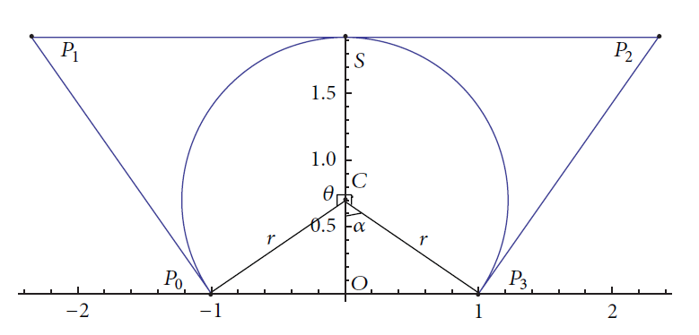

- The order of points chain is $P_0\rightarrow P_1\rightarrow P_2 \rightarrow P3$
- The start point is $P_0$
- The end point is $P_3$
- To simplify the explantion, just make weight of $P_i$ is $w_i$
- For easily programming, just make
    - $w_0=1$
    - $w_1=w$
    - $w_2= w$
    - $w_3=1$

- Towards parameter $m$, it's produced by calculation according to known variables, which are the coordinates of $P_0,P_3$ and angle of $\theta,\alpha$. The equation is as followed:

$$
w=\left(\cfrac{m-2}{m}\right)\cfrac{\overrightarrow{P_3P_0}\cdot \overrightarrow{P_2P_1}}{\overrightarrow{P_2P_1}\cdot \overrightarrow{P_2P_1}}
$$

- The basic idea is that we need to ensure the equation $(1)$ is quadratic about $u$ for a 2D circle. 

    - Since middle points $P_1,P_2$ have the same weight, so we can ensure the dominator is quadratic.
    - What we need to do left is that parameter ensure the coefficient of $u^3$ is 0. According to $B_i(u)$, we can get:

    $$
    (2-m)(P_0-P_3)+m(P_1-P_2)w=0
    $$
    - From equation (3) and $\overrightarrow{P_2P_1}||\overrightarrow{P_3P_0}$, we can get equation (2) easily

#### How to get X-coordinate and Y-coordinate?

We still use the former picture to illustrate the parameters' definition.

##### Preparation

- $P_0=(-1,0)\ and\ P_1=(1,0)$
- Except for that, the other input parameter is angle $\alpha$, which actually is angle $OCP_3$
    - point $O$ is origin
    - point $C$ is the center of circle
        - $C(0,cot\alpha)$
    - point $P_3$ is the end point
- From the geometric principle, we can calculate the radius $r$ and  exact coordinates of $P_1,P2$
    - $r=csc\alpha$
    - $P_1(-rcot\cfrac{\alpha}{2},r+rcos\alpha)$
    - $P_2(rcot\cfrac{\alpha}{2},r+rcos\alpha)$

- Finally, we can get the X-coordinate and Y-coordinate:

$$
\begin{aligned}
r(u)&=(x,y)\\
x(u)&=\cfrac{2u-1}{1+2(u-1)u+(m-2)(u-1)ucos\alpha}\\
y(u)&=\cfrac{(m-2)(u-1)usin\alpha}{1+2(u-1)u+(m-2)(u-1)ucos\alpha}
\end{aligned}
$$

- We can use equation $x^2(u)+(y(u)-cot\alpha)^2=csc^2\alpha$ to prove the correctness of $x(u)$ and $y(u)$

#### How to draw?

- When using OpenGL to implement drawing a circle, I just use the parametric coordinates to draw.
- All input parameter is angle $\alpha$, and $P_0,P_1$ is fixed, while all other can be calculated by equation.
- By adjusting the angle to limit, we can get a nearly circle, but still exists a very small gap, so the perfect solution still needs to draw twice, and one is for , the other is for 

#### Related:

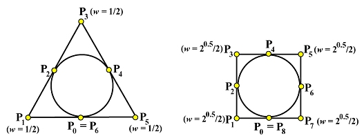

- I think the quadratic bezier curve is more easy to implement, and the weight is easy to calculate.

#### Info about program

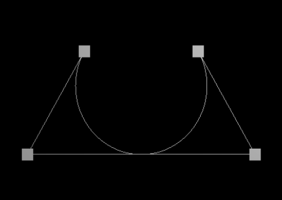

- Four points
- Line is attachment of points
- current $\alpha$ is 60°

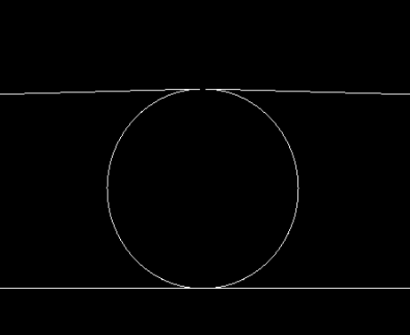

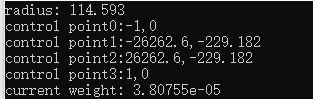

- current $\alpha$ is 1°
- It‘s almost a circle
- In fact， I think using two semicircles is better choice, which mean we need to draw two quadratic bezier curves. But using one quadratic bezier curves can still get a nearly circle

## Surface Revolution by NURBS

- For bonus, I don't know the meaning of it, because bezier curve is one special case of NURBS, and to get this bonus, I just need to **rorate one bezier curve around some axis**, then I can get a surface of revolution. 
  
    - There are 11 control points to draw a half a curve
    - using the equation following to calculate every sample points
    
    $$
    R(t)=\cfrac{\sum_{i=0}^nB_{i,n}(t)w_iP_i}{\sum_{i=0}^nB_{i,n}(t)w_i}\\
    B_{i,n}(t)=C_{n}^{i}t^i(1-t)^{n-i}\\
    t\in [0,1]
    $$
    
    - The demo as followed:

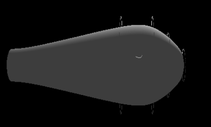

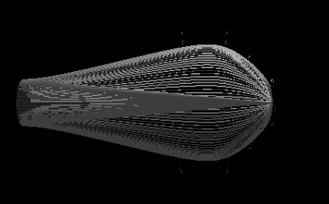

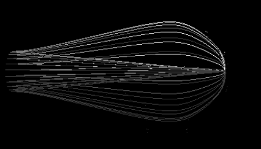

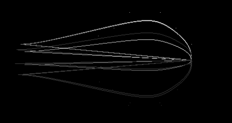

- So besides drawing a simple surface, I find a program can calculate NURBS surface directly, and it's very beutiful and more efficient.

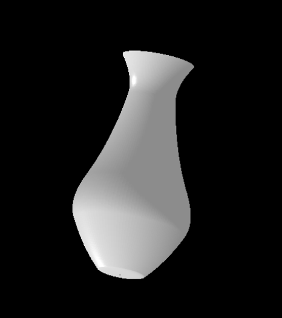

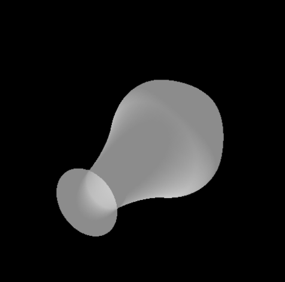