# Homwork5

- 姓名：郭炅
- 学号：3170105370
- 专业：计算机科学与技术
- 授课老师：张宏鑫

## Requirement

- Render a car with POVRAY
- Resolution: > 640 $\times$ 480

## Result

### 1st Method

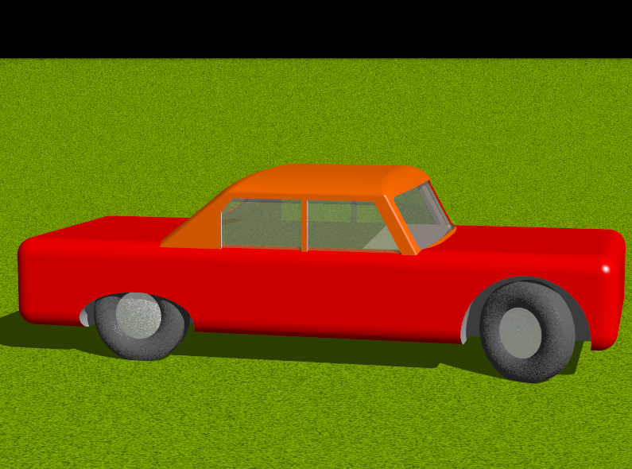

- A red car with inside space
- Four wheels combined with some basic solid figures
- draw by use some CSG method with basic graphes

### 2nd Method

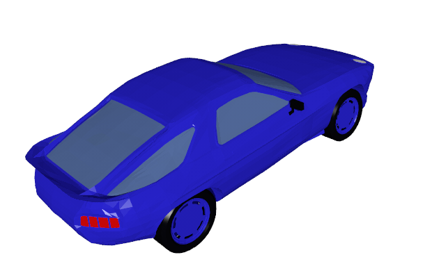

- A blue car with more details
- The geometric relationship is normal and surface is more smooth

## Details

### 1st Structure

graph

|--ground

​		|--plane with grass texture

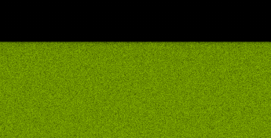

|--car

​		|--Top part of car

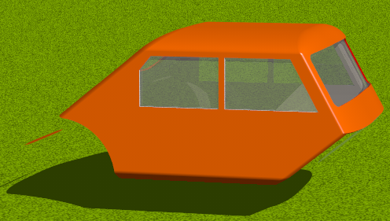

​				|--entity combined by two intersected round boxes

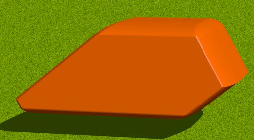

​				|--(difference) front and back axles

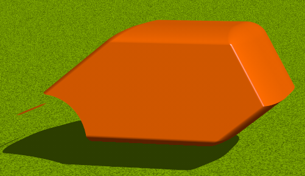

​				|--(difference) inside space in entity combined by two intersected round boxes(all in the inside space, so pic cannot show this procedure until next step)

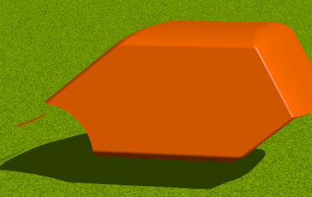

​				|--(difference, then intersection)side windows

​						|--two prisms intersected with inside space

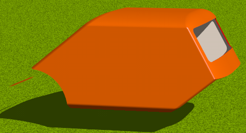

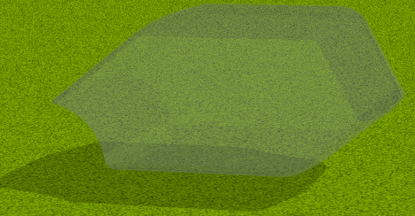

​				|--(difference, then intersection)font and back windows

​						|--two round boxes intersected with inside space

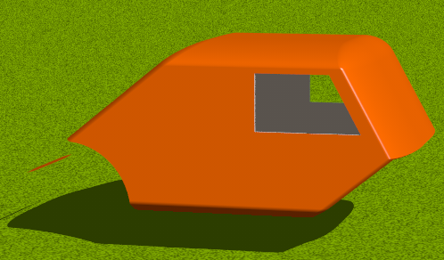

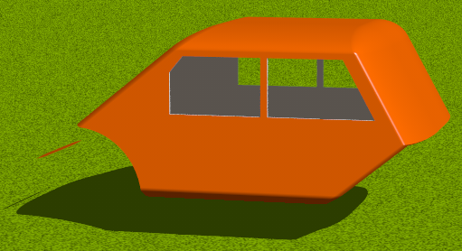

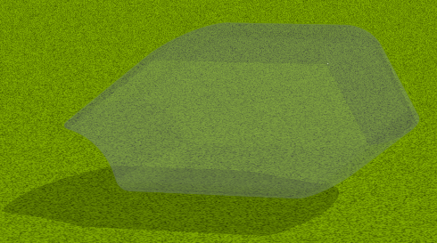

​		|--Middle part of car

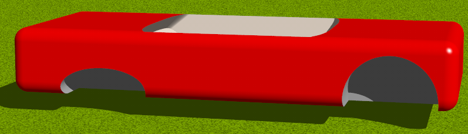

​				|--base entity, a round box

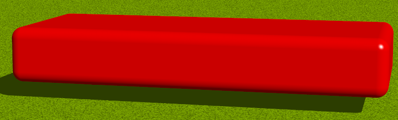

​				|--(difference)space for wheels

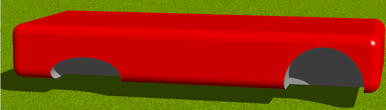

​				|--(difference)inside space in entity combined by two intersected round boxes

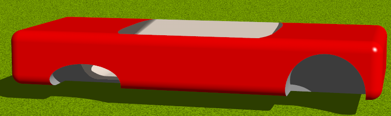

​				|--(plus) front and back axles, part of two cylinders(intersected with inside sapce). The reason is that simple difference will poduce hole, so must front and back axles.

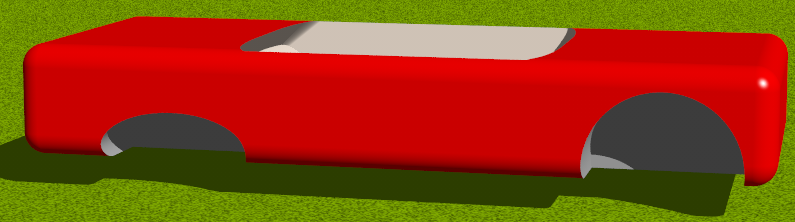

​		|--wheels

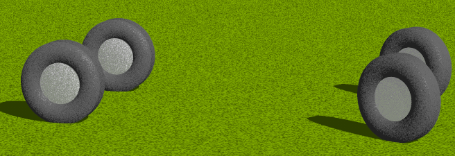

​				|--single wheel

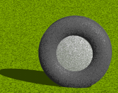

​						|--tire, intersection combined by torus and cylinder

​																								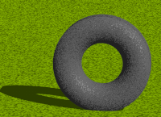			

​						|--wheel hub, which is sphere

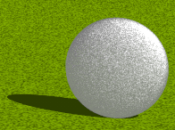

### 2nd Structure

This method uses obj's data and draws the many meshes to construct smooth surfaces. Towards different meshes, give them different color. 